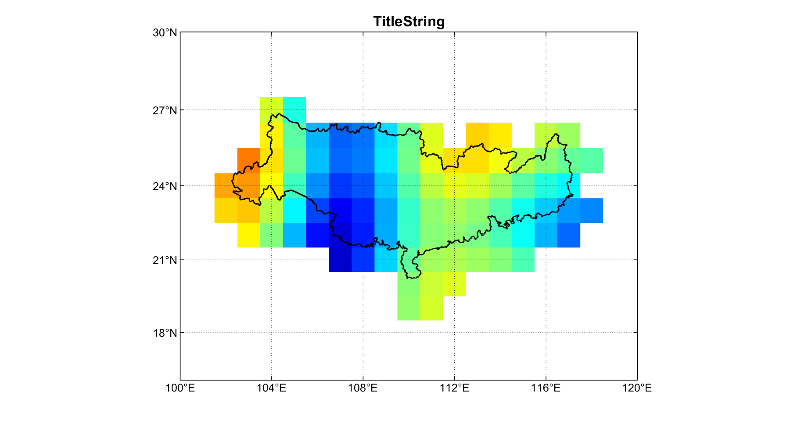

# Geodesy-Experiment

A vault help to solve some issues in SYSU Geodesy-Experiment...

该函数包能使格网形式数据在.bln文件中的特定范围内呈现，但由于格网分辨率的缘故会存在部分溢出情况，

可根据需求通过expand_polygon函数进行调整。

使用时在DrawSpecialArea.m文件中修改数据文件与边界文件即可~

效果图展示如下：

### 注意：运行该函数包需要依赖m_map绘图库
